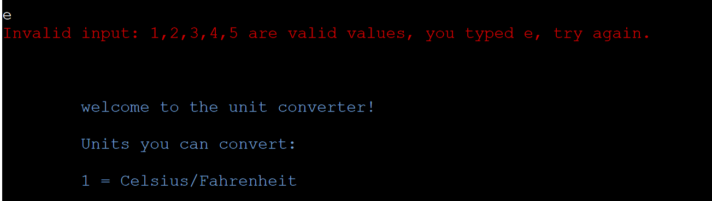
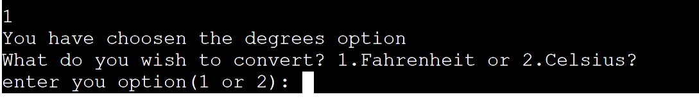
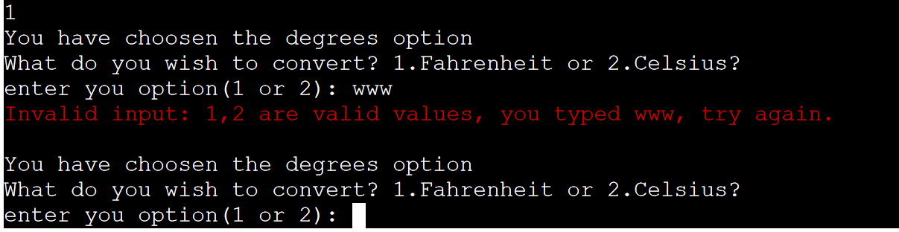
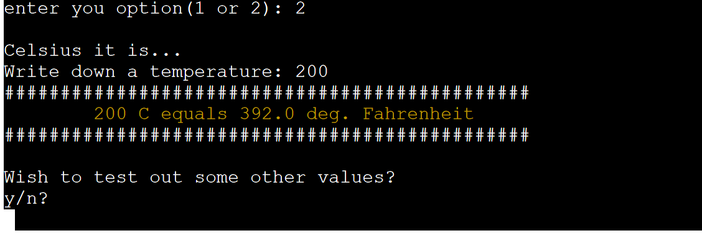
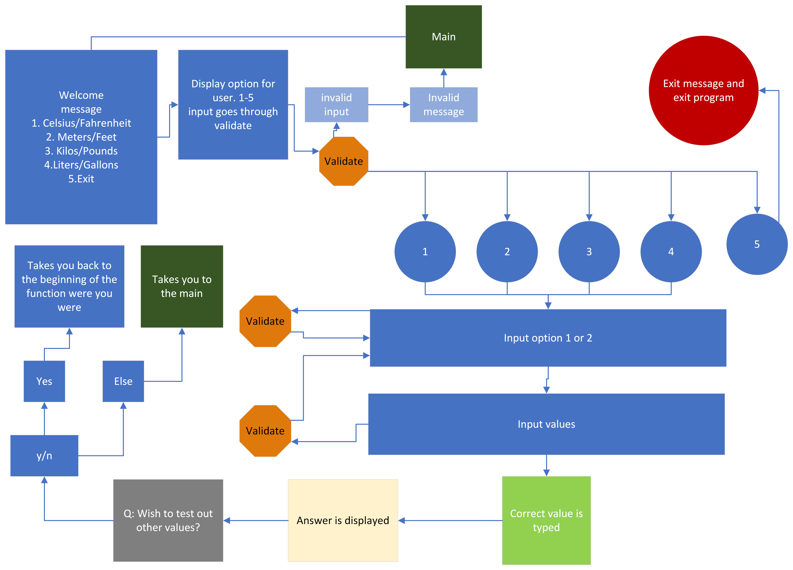

# Units Converter

The units converter is a python terminal program that takes values from the user and converts it to other units.

[The live site is found here](https://units-converter-awrel.herokuapp.com/)

# How to use

The program is very straightforward. You will as a user be presented with 5 options. Four of them equals conversion choices. 
- Celsius / Fahrenheit
- Meters / feet
- Kilos / pounds
- Liters / gallons

# walkthrough of the program

- You are welcomed with a short message and an option menu.

- Choose a number between 1-5, if not correct input you will get an error message in the colour red and retry new input.

- After correct choice you will go to that part of the program. 

- If you correct input is typed, you go to next phase and add value that will be calculated, else you will get a message about invalid input in red.

- When correct value is typed, 1 or 2, you can type a value and then get an answer message with an option to try new values. 

If the answer is yes, you go back to program and choose what parameter you want to have converted. Else you will be sent to the main option menu.

## the plot layout

Made with Microsoft Visio.

# Testing
I have tested the program for each of the steps and tried to commit as often as I could. This has helped to avoid bugs. 

## Bugs
Some of the bugs that I have come across wasn't too hard to handle. Foremost it was string input that couldn't be handled since they weren't integers or floats. That was easily handled by using the int() or float()-function in the equations.

When adding colorama to the project I forgot to add it to the requirements.txt, thus creating getting an error message `ModuleNotFoundError: No module named 'colorama`
 in Heroku terminal. 

One of the last bugs that I found was that after I ran a program e.g. degrees(), and came back to main-menu and choose the exit-option was that I didn't exit the program. Instead, I was stuck in a loop, with the menu. I then tried to do a separate function just to exit while not being in the while-loop of the choices. Didn't help, removed some while-loop, but still the same result. After some trial and errors, I went for the built-in function exit() that did the trick. I would count this as a bug that was not solved.  

## Validation
I validated my code via the pep8 online check, (http://pep8online.com/) without any error messages. This was possible by continuously reading the 'problems' message that was presented in the Gitpod IDE. 

# Deployment

### GitHub Pages

The project was created on github, by first forking the Code Institute template and since it's a python project, github does not manage to have it deployed in its pages. 

### Heroku 

Heroku was the platform the project was deployed to.
1. Create an account.
1. On the dashboard select `New` and `Create new app` which takes you to right place.
1. Name the app, select `region`, click `Create new app`.
1. Go to `settings`.
1. Config Vars >> reveal vars >> add key:PORT, value: 8000 and click add
1. add `buildingpacks` - add nodejs and python
1. go to `Deploy` and choose method, `github` in this case, connect to it.
1. Search and select/connect to your repository
1. Choose `Deploy Branch` method, automatic or manual, I choose manual.
1. Heroku will do its job connecting, and create a link to page.
1. When message `Your app was successfully deployed` is recieved you can `view` the site.

